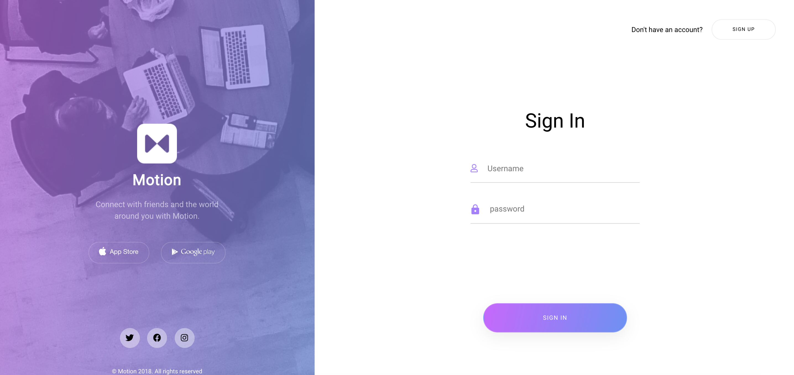
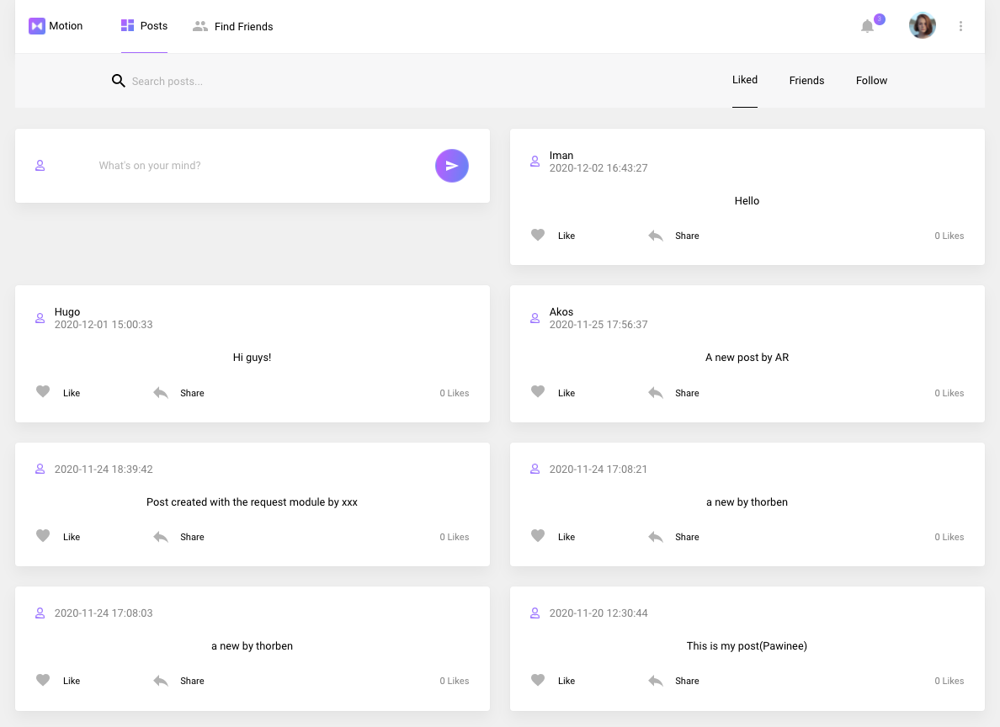

# Social Networking Web Application

 
  

  

###  Notes

This project was done as an personal assignment during the Full-Stack program at Propulsion Academy. 
  

# How to run the project

### Backend: 
[Link to Backend](#backend-section)

- In the root folder of the project:
    - docker-compose up
    - search for the name of the container to access it:
        - docker exec -ti 'name of the container' bash
    - inside the container:
        - python manage.py migrate
        - python manage.py makemigrations
        - python manage.py createsuperuser
        - python manage.py runserver 0.0.0.0:8000
    
- In your broswer go to : **localhost:8000/backend/admin/**

### Frontend: 
[Link to Frontend](#frontend-section)

- In the folder Frontend:
    - npm install
    - npm start
    
- In your broswer go to : **localhost:3000**
  

<h1 id="frontend-section">Frontend</h1>

This project was bootstrapped with [Create React App](https://github.com/facebook/create-react-app).

## Available Scripts

In the project directory, you can run:

### `npm start`

Runs the app in the development mode. 
Open [http://localhost:3000](http://localhost:3000) to view it in the browser.

The page will reload if you make edits. 
You will also see any lint errors in the console.

### `npm test`

Launches the test runner in the interactive watch mode. 
See the section about [running tests](https://facebook.github.io/create-react-app/docs/running-tests) for more information.

### `npm run build`

Builds the app for production to the `build` folder. 
It correctly bundles React in production mode and optimizes the build for the best performance.

The build is minified and the filenames include the hashes. 
Your app is ready to be deployed!

See the section about [deployment](https://facebook.github.io/create-react-app/docs/deployment) for more information.

### `npm run eject`

**Note: this is a one-way operation. Once you `eject`, you can’t go back!**

If you aren’t satisfied with the build tool and configuration choices, you can `eject` at any time. This command will remove the single build dependency from your project.

Instead, it will copy all the configuration files and the transitive dependencies (webpack, Babel, ESLint, etc) right into your project so you have full control over them. All of the commands except `eject` will still work, but they will point to the copied scripts so you can tweak them. At this point you’re on your own.

You don’t have to ever use `eject`. The curated feature set is suitable for small and middle deployments, and you shouldn’t feel obligated to use this feature. However we understand that this tool wouldn’t be useful if you couldn’t customize it when you are ready for it.

## Learn More

You can learn more in the [Create React App documentation](https://facebook.github.io/create-react-app/docs/getting-started).

To learn React, check out the [React documentation](https://reactjs.org/).

### Code Splitting

This section has moved here: https://facebook.github.io/create-react-app/docs/code-splitting

### Analyzing the Bundle Size

This section has moved here: https://facebook.github.io/create-react-app/docs/analyzing-the-bundle-size

### Making a Progressive Web App

This section has moved here: https://facebook.github.io/create-react-app/docs/making-a-progressive-web-app

### Advanced Configuration

This section has moved here: https://facebook.github.io/create-react-app/docs/advanced-configuration

### Deployment

This section has moved here: https://facebook.github.io/create-react-app/docs/deployment

### `npm run build` fails to minify

This section has moved here: https://facebook.github.io/create-react-app/docs/troubleshooting#npm-run-build-fails-to-minify
  

<h1 id="backend-section">Backend</h1>

## REST API Backend Endpoints
All the following endpoints should be prefixed with /backend

#### Registration
* `/api/auth/registration/` POST: Register a new user by asking for an email (send email validation code)
* `/api/registration/validation/` PATCH: Validate a new registered user with a validation code sent by email

#### Authorization
* `/api/auth/token/` POST: Get a new JWT by passing username and password
* `/api/auth/token/refresh/` POST: Get a new JWT by passing an old still valid refresh token
* `/api/auth/token/verify/` POST: Verify a token by passing the access token

#### Post
* `/api/social/posts/` GET,POST: user can make a new post by sending post data, or get all posts
* `/api/social/posts/<int:post_id>/` GET, PATCH, DELETE: get a specific post by ID and display all the information about that post. Update or delete it if logged in user is the original poster or admin
* `/api/social/posts/toggle-like/int:post_id>/` POST: Toggle like a post
* `/api/social/posts/likes/` GET: the list of the posts the user likes
* `/api/social/posts/me/` GET: lists all the posts of logged in user
* `/api/social/posts/following/` GET: lists all the posts of of users the logged in user is following in chronological order
* `/api/social/posts/friends/` GET: lists all the posts of the logged in user’s friends in chronological order

#### User
* `/api/users/` GET: Get all the users
* `/api/users/<int:user_id>/` GET: Get specific user profile
* `/api/users/me/` GET: Get logged in user’s profile (as well as private information like email, etc.)
* `/api/users/me/` PATCH: Update the logged in user’s profile public info 
* `/api/users/me/` DELETE: Delete logged in user
* `/api/social/followers/toggle-follow/<int:user_id>/` POST: Toggle follow/unfollow a user
* `/api/social/followers/following/` GET: List of all the users the user is following
* `/api/social/followers/followers/` GET: List of all the logged in user’s followers

#### Friend
* `/api/social/friends/` GET: List all accepted friends
* `/api/social/friends/request/<int:user_id>/` POST: Send friend request to another user
* `/api/social/friends/requests/<int:friend_request_id>/` GET: Get details of a friend request
* `/api/social/friends/requests/<int:friend_request_id>/` PATCH: Accept or Reject an open friend request
* `/api/social/friends/requests/<int:friend_request_id>/` DELETE: Delete a friend request

